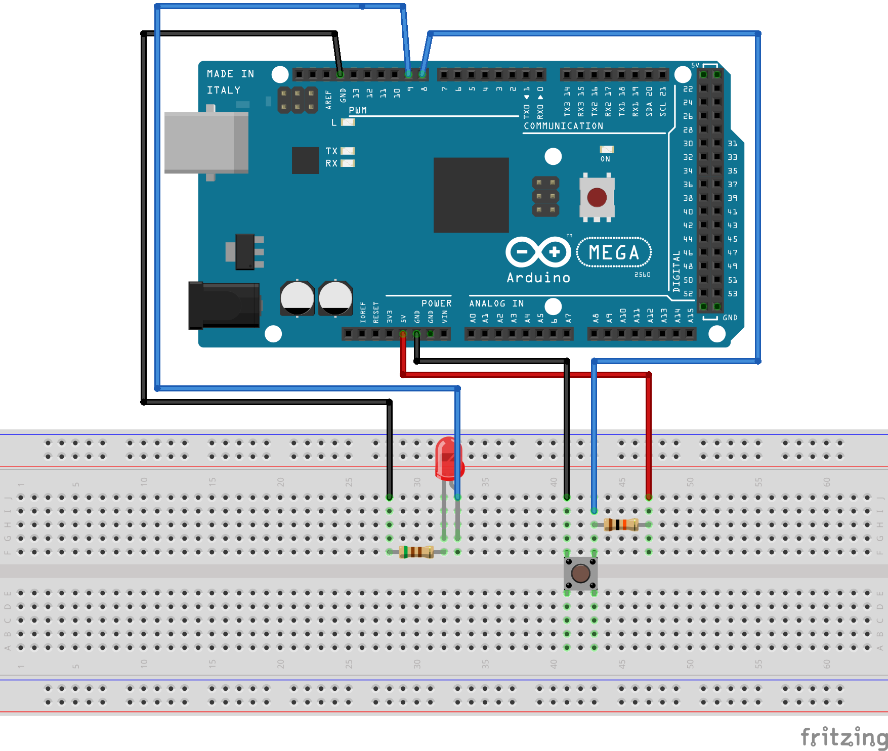

# MBDFirstStudy
Arduinoでモデルベース開発 
Lチカ、タイマー、AD変換・PWM・シリアル送信 
 
## 開発環境
●MATLAB, Simulink R2019b 
●Arduino MEGA ※Arduino UNOでも可。 
 
## 開発環境 動作確認バージョン
●MATLAB, Simulink 
--------------------------------------------------------------------------------------------------- 
・MATLAB バージョン: 9.7.0.1319299 (R2019b) Update 5 
・MATLAB ライセンス番号: 40368293 
・オペレーティング システム: Mac OS X  Version: 10.15.4 Build: 19E287  
・Java バージョン: Java 1.8.0_202-b08 with Oracle Corporation Java HotSpot(TM) 64-Bit Server VM mixed mode 
--------------------------------------------------------------------------------------------------- 
MATLAB                                                バージョン 9.7           (R2019b) 
Simulink                                              バージョン 10.0          (R2019b) 
 
●Simulink Support Package for Arduino Hardware バージョン19.2.2 
## ブレッドボード接続図
### Lチカ(led_switch/led_switch.slx)

 
### AD変換・PWM・シリアル送信(serial_ad_pwm/serial_ad_pwm.slx)

 
